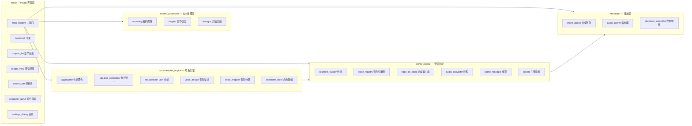
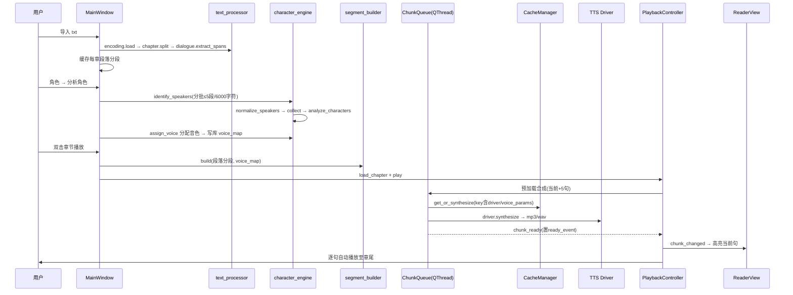

# xMOD-AAE — AI 有声阅读引擎 模块文档

## 1. 项目概述

**定位**：AI 有声阅读引擎桌面端（Windows/macOS），实现「txt 导入 → 文本角色识别 → 音色匹配 → 语音合成 → 逐句播放」的完整 TTS 工作流，并支持 PC 本地（Ollama + Edge TTS）与云端（OpenAI 兼容 API + MiMo TTS）双后端。

**技术栈**：Python 3 + PyQt6（界面）、pygame（音频播放）、edge-tts（免费云端 TTS）、httpx（HTTP 客户端）、sqlite3（本地存储）、keyring（密钥存储）、mutagen（音频时长）、chardet（编码探测）、ffmpeg（音频转码）。



## 2. 目录结构

```
xMOD-AAE/
├── Plan.md               # 产品规划与开发进度
├── requirements.txt      # 依赖清单
├── docs/
│   └── MODULES.md        # 本文档
├── src/
│   ├── main.py               # 程序入口
│   ├── config.py             # 路径配置（AppData/books/cache/db）
│   ├── secret_store.py       # API 密钥安全存储
│   ├── text_processor/       # 文本处理层
│   │   ├── encoding.py       #   编码探测与解码
│   │   ├── chapter.py        #   章节切分
│   │   └── dialogue.py       #   对话/旁白分段
│   ├── character_engine/     # 角色引擎
│   │   ├── aggregator.py     #   台词统计聚合
│   │   ├── speaker_normalizer.py # 称呼归一化
│   │   ├── llm_analyzer.py   #   LLM 角色分析 / 说话人识别
│   │   ├── voice_design.py   #   自然语言音色描述生成
│   │   ├── voice_mapper.py   #   角色→音色分配
│   │   └── character_store.py#   书籍/角色/音色映射 SQLite 存储
│   ├── tts_engine/           # 语音合成引擎
│   │   ├── voice_registry.py #   Edge TTS 中文音色注册表
│   │   ├── edge_tts_client.py#   edge-tts 异步/同步合成
│   │   ├── audio_converter.py#   ffmpeg WAV→MP3 转码
│   │   ├── cache_manager.py  #   合成音频缓存
│   │   ├── segment_builder.py#   TTS 分块构建
│   │   └── drivers/          #   引擎驱动体系
│   │       ├── base.py       #     TTSDriver 抽象基类
│   │       ├── manager.py    #     DriverManager 注册表
│   │       ├── edge_tts_driver.py # Edge TTS 驱动
│   │       └── mimo_driver.py     # 小米 MiMo TTS 驱动
│   ├── player/               # 播放层
│   │   ├── chunk_queue.py    #   后台合成/预加载队列(QThread)
│   │   ├── audio_player.py   #   pygame 音频播放封装
│   │   └── playback_controller.py # 播放状态机与信号中枢
│   └── ui/                   # PyQt6 界面层
│       ├── main_window.py    #   主窗口与业务编排
│       ├── bookshelf.py      #   书架页
│       ├── chapter_list.py   #   章节目录
│       ├── reader_view.py    #   阅读区（分段/播放高亮）
│       ├── control_bar.py    #   播放控制条
│       ├── character_panel.py#   角色列表与音色编辑
│       └── settings_dialog.py#   偏好设置对话框
└── tests/                    # pytest 单元测试
```

## 3. 基础设施层

### 3.1 `src/main.py` — 程序入口
- 设置环境变量：`QT_QPA_PLATFORM=windows:darkmode=0`（禁用暗色模式）、`PYGAME_HIDE_SUPPORT_PROMPT=1`。
- 初始化 pygame 与混音器 → 创建 `QApplication`（Fusion 风格）→ 实例化并显示 `MainWindow` → 进入 Qt 事件循环。
- 退出时 `finally` 中释放 pygame 混音器，保证资源清理。

### 3.2 `src/config.py` — 路径配置
统一管理应用数据目录（全部在 `%APPDATA%\xMOD-AAE` 下，自动创建）：
- `get_app_data_dir()` — 根目录 `%APPDATA%/xMOD-AAE`
- `get_books_dir()` — 导入书籍副本目录 `books/`
- `get_cache_dir()` — TTS 音频缓存目录 `cache/`
- `get_db_path()` — SQLite 数据库 `store.db`

### 3.3 `src/secret_store.py` — 密钥安全存储
- 仅处理两类敏感设置：`mimo_api_key`、`llm_api_key`（`is_secret_key()` 判定）。
- **优先**使用系统凭据库（keyring，如 Windows 凭据管理器）；keyring 不可用或失败时**降级**到 `secrets.json` 文件（AppData 下）。
- 提供 `get_secret / set_secret / clear_secret`，所有读写异常均静默回退，保证应用不因密钥存储失败而崩溃。
- 设计要点：密钥**不**进入共享的 settings 表明文存储。

## 4. 文本处理层 `src/text_processor/`

### 4.1 `encoding.py` — 编码探测与解码
- `load(filepath)`：以二进制读取文件 → `chardet.detect()` 探测编码。
- 置信度 ≥ 0.7 时按探测结果解码；失败则依次尝试常见中文编码 `GBK / GB2312 / GB18030 / UTF-8 / UTF-16`。
- 全部失败时抛出 `UnicodeDecodeError`。

### 4.2 `chapter.py` — 章节切分
- `split(text)`：用三组正则识别章节标题——`第X章`、`第X卷`（支持中文数字/阿拉伯数字）、`Chapter N`。
- 返回 `[(标题, 内容), ...]`；首个匹配的模式生效。
- 无任何章节标记时降级为单个 `("全文", text)`；空文本返回空列表。

### 4.3 `dialogue.py` — 对话/旁白分段
核心数据类 `DialogueSegment`：`text`（文本）、`speaker`（说话人，可空）、`start/end`（段落内偏移）、`is_dialogue`（是否对话）。

`extract_spans(paragraph)` 的处理管线：
1. **引号配对** `_find_quotes`：用栈匹配 6 组引号对（`「」` `《》` `“”` `‘’` 及中/英文直引号），内容长度 ≥3 才识别为对话。
2. **冒号说话人** `_find_colon_spans` / `_find_colon_dialogue_spans`：匹配「1–6 字名称 + `：`/`:`」的说话人前缀，取其后的内容。
3. **重叠消解** `_resolve_overlaps`：按位置排序合并两类区间，对话（引号）优先，消除嵌套/交叉。
4. **区间转分段** `_merge_segments`：区间外的内容标记为旁白（`is_dialogue=False`），区间内为对话。
5. **校验回退** `_validate_segments`：逐段拼接必须还原原文，否则整体回退为单个旁白段，保证偏移量永远正确。

## 5. 角色引擎 `src/character_engine/`

> 角色分析工作流：`identify_speakers`（LLM 给每句对话标说话人）→ `normalize_speakers`（称呼归一化）→ `collect`（统计聚合）→ `analyze_characters`（LLM 生成角色画像）。

### 5.1 `aggregator.py` — 台词聚合
- `SpeakerInfo`：`name / total_lines（台词数）/ total_chars（总字数）/ sample_quotes（示例台词）`。
- `collect()`：接受扁平列表或按段落嵌套的 `DialogueSegment` 列表，按说话人聚合统计；示例台词去重后按长度降序取前 5 条（作为 LLM 分析输入）。

### 5.2 `speaker_normalizer.py` — 说话人称呼归一化
- 将泛指称呼（`他/她/少年/小姐/侍卫/丫鬟` 等，见 `_TITLE_TERMS` 与 `_NON_NAME_DENYLIST`）统一替换为最正式的姓名。
- 保留词：`未知 / 旁白 / 空`（`_PRESERVED`）。
- 归一目标：**段落内共现的正式人名优先**（嵌套段落输入时），否则取全书出现频次最高的正式人名。
- 就地修改（in-place），不返回新对象。

### 5.3 `llm_analyzer.py` — LLM 角色分析（核心）
数据类 `CharacterProfile`：`name / gender / age_group / personality / role_type / speaking_style / summary / voice_id`。

**后端路由（`_call_llm`）严格以 `llm_mode` 设置为准**：
- `llm_mode="cloud"` → `_call_cloud_api`（OpenAI 兼容协议）。
- `llm_mode="ollama"` → 先 `probe_ollama()`，不可达时抛 `RuntimeError("Ollama 不可用…")`；云端未配置端点/密钥时抛 `RuntimeError("云端 API 未配置…")`，**不再静默产出「未知」角色**。

主要方法：
- `probe_ollama()` — GET `localhost:11434/api/tags` 探测（5s 超时），结果缓存，同时收集可用模型列表。
- `_resolve_ollama_model()` — 优先用户配置的模型；过滤视觉类模型（vl/vision/clip/llava 等）；按 `qwen2.5 → qwen → llama3-chinese → yi → gemma2 → mistral` 优先级挑选，最后兜底 `qwen2.5:7b`。
- `analyze_characters(speakers, progress_callback)` — 每 5 个角色一批（`_SYSTEM_PROMPT` 要求严格 JSON），拼接统计信息与示例台词；解析失败时该批角色产出默认画像。
- `identify_speakers(paragraph_batches, progress_callback)` — 将对话区间用 `【对话N】…【/对话】` 标记后送 LLM（`_SPEAKER_ID_PROMPT`，120s 超时）；返回 `assignments` 数组回填 `span.speaker`；解析失败时以「只输出 JSON」的纠正提示自纠错一次。
- `_call_ollama` — POST `/api/chat`，`"format":"json"` 强制服务端只输出 JSON（需 Ollama ≥ 0.3.4），带超时透传。
- `_call_cloud_api` — 恒带 `response_format={"type":"json_object"}`；仅当 4xx（不支持该字段）时去掉重试一次；**超时等错误不重试**，返回 `None` 交给上游自纠错；不设 `max_tokens`。
- `_parse_json_response` — 依次尝试：直接 `json.loads` → 去除 markdown 代码围栏 → 正则提取数组 → 正则提取对象，全失败返回 `None`。

### 5.4 `voice_design.py` — 音色描述生成
- `build_voice_description(profile)` — **纯模板拼接、不调 LLM**：由性别、年龄段、性格标签（前 2 个）、说话风格、简介组合成中文自然语言描述，如「一位青年的男性，语速快、直率，。胆大心细」。
- 供 MiMo `mimo-v2.5-tts-voicedesign` 模型使用；无有效信息时返回空串。

### 5.5 `voice_mapper.py` — 角色→音色分配
- `assign_voice(profile, available_voices, used_voices, driver_id)`：
  - 过滤中文音色（`locale` 以 `zh-` 开头）→ 按性别（`男/女`）筛选 → 按年龄段（`少年/青年/中年/老年`）筛选 → 优先未占用音色 → 兜底第一个中文音色。
  - 返回 `(driver_id, voice_id, voice_params)`；`mimo` 驱动时自动生成 `voice_params={"voice_description": ...}`。
- `assign_narrator_voice(settings, available_voices, driver_id)` — 从设置取旁白音色，非法时回退默认；mimo 驱动时透传旁白音色描述。

### 5.6 `character_store.py` — 本地持久化（SQLite）
- 数据表：`books`（书籍）、`characters`（角色画像）、`voice_map`（说话人→音色映射）、`settings`（键值设置）。
- WAL 模式 + 外键约束；**幂等迁移**：`_ensure_column()` 按列名守卫执行 `ALTER TABLE ADD COLUMN`（`voice_map/characters` 增加 `driver` 与 `voice_params` 列），旧库自动升级无需删表。
- 核心 API：
  - `init_db / close`；`save_characters / get_characters`
  - `update_character_voice`（同步更新 characters 与 voice_map）
  - `get_voice_map`（始终含 `_narrator_` 项，缺失时从 settings 兜底 `zh-CN-XiaoxiaoNeural` / `edge-tts`）
  - `save_voice_map`（兼容 `speaker→voice_id` 裸字符串旧格式）
  - `get_setting / set_setting / get_all_settings`（**密钥键自动路由到 secret_store**，settings 表不存明文）
  - `add_book / get_books / get_book / delete_book`（级联删除子表）
  - `update_position / get_position`（读写进度 `"章,句"`）

## 6. 语音合成引擎 `src/tts_engine/`

### 6.1 `drivers/base.py` — 驱动抽象基类
`TTSDriver(ABC)` 定义统一接口：类属性 `id / display_name / output_format / requires_api_key`；抽象方法 `get_voices() / get_default_narrator_voice() / synthesize(text, voice, output_path, voice_params, retries)`；`is_available()` 默认 True（需密钥的驱动重写）。构造函数可注入 `get_settings(key, default)` 回调读取运行时设置。**后续新引擎只需继承并注册一行即可接入**。

### 6.2 `drivers/manager.py` — 驱动注册表
- `DriverManager`：`register / list_drivers / get_driver / get_current_driver / set_current_driver`。
- 当前引擎 ID 持久化在 settings 的 `tts_driver` 键下（默认 `edge-tts`）；存疑时回退默认驱动。

### 6.3 `drivers/edge_tts_driver.py` — Edge TTS 驱动
- `id="edge-tts"`、输出 `mp3`、无需 API 密钥。
- 委托 `voice_registry` 提供音色列表，委托 `edge_tts_client.synthesize_sync` 合成。

### 6.4 `drivers/mimo_driver.py` — 小米 MiMo TTS 驱动
- `id="mimo"`、`requires_api_key=True`（`is_available()` 检查密钥）。
- 两种模式：
  - **内置音色**：`mimo-v2.5-tts` + `audio.voice`；
  - **voicedesign**：`mimo-v2.5-tts-voicedesign`，首个 user 消息放音色描述，assistant 放待朗读文本。
- OpenAI 兼容协议，`audio.format=wav`、base64 音频；失败按指数退避重试 3 次（60s 超时）。
- 产出 WAV → 写临时文件 → `wav_to_mp3`（ffmpeg，路径来自设置）转 MP3；**ffmpeg 缺失时降级保留 WAV**（`.wav` 同 key 落盘）。
- `_MIMO_VOICES` 目前仅内置 `Chloe`（待官方确认后补全）。

### 6.5 `drivers/__init__.py` — 驱动工厂
`create_driver_manager(get_settings, set_settings)` — 注册 `EdgeTTSDriver` + `MiMoTTSDriver`，供主窗口装配。

### 6.6 `voice_registry.py` — Edge TTS 中文音色注册表
- 内置 29 个中文音色（含普通话/粤语/台湾国语/辽宁话/陕西话），带 `name / gender / locale / age_group / description` 元数据。
- API：`get_voices()`（返回副本）、`get_default_narrator_voice()`（`zh-CN-XiaoxiaoNeural`）、`get_voice_by_name()`。

### 6.7 `edge_tts_client.py` — edge-tts 合成客户端
- `synthesize()`（async）：`edge_tts.Communicate(...).save()`，失败指数退避重试（默认 3 次）。
- `synthesize_sync()`：每次调用创建并关闭独立事件循环，供 QThread 工作线程同步调用。

### 6.8 `audio_converter.py` — ffmpeg 转码
- `wav_to_mp3(wav_path, mp3_path, ffmpeg_path)`：`subprocess` 调用 ffmpeg（`libmp3lame`、`-q:a 2`、180s 超时），验证输出文件非空；ffmpeg 缺失/超时/失败均返回 `False`。

### 6.9 `cache_manager.py` — 合成音频缓存
- **缓存键**：`md5(driver_id | voice | json(voice_params) | text | speed)` —— 驱动与音色参数纳入键，**切换引擎或修改 voicedesign 描述绝不复用旧音频**（`get_cache_key`）。
- `get_or_synthesize()`：线程安全（互斥锁）检查命中 → 未命中调用注入的 `synthesize_fn` → 返回实际落盘路径；考虑 `.wav` 降级兄弟文件（`_candidate_paths`）。
- `clear_cache / get_cache_size_mb / enforce_size_limit`（按访问时间从旧到新删除，直到低于 `max_size_mb`，默认 500MB）。
- 注：`speed` 目前仅计入缓存键，MVP 阶段播放速度由 pygame 播放速率决定。

### 6.10 `segment_builder.py` — TTS 分块构建
数据类 `ChunkInfo`：`text / voice_id / char_start / char_end / mp3_path / duration_ms / ready_event(threading.Event) / driver_id / voice_params / speaker`。

`build(dialogue_segments, voice_map, char_offset)` 的管线：
1. 逐段按说话人查音色（无说话人 → `_narrator_` 旁白音色），记录全局字符偏移。
2. **相邻同音色同说话人合并**，减少合成请求数。
3. **超长文本拆分** `_split_long_text`：>200 字符在标点（`，；。！？、：`）处切分，目标 100–200 字符/块；单句超长按字符边界硬切。
4. 产出有序 `ChunkInfo` 列表，供播放控制器与合成队列消费。

## 7. 播放层 `src/player/`

### 7.1 `playback_controller.py` — 播放控制中枢（QObject）
- 信号：`chunk_changed / state_changed / chapter_changed / progress_updated / playback_finished`。
- `load_chapter()`：调用 `segment_builder.build` 逐段生成全章 `ChunkInfo`，再 `_attach_chunk_voice_meta()` **按说话人**回填 driver/voice_params（保证多角色共享音色时 voicedesign 不串）。
- 播放状态机：`play / pause / stop / next_chunk / prev_chunk / seek_to_chunk / set_speed / set_volume`。
- 曲目结束检测：自定义 pygame 事件 `USEREVENT+1` + 100ms `QTimer` 轮询，自动播下一句；播完全章发 `playback_finished`。

### 7.2 `chunk_queue.py` — 后台合成/预加载队列（QThread）
- `configure(chunks, start_index, speed, cache_manager, driver_manager, ...)`：预加载当前句起 `preload_count`（默认 5）句。
- `run()`：对每块经 `CacheManager.get_or_synthesize` 合成（`_resolve_driver` 按 chunk 的 driver 回退当前驱动），读取时长（mutagen，按扩展名分派 MP3/WAVE），置 `ready_event` 并 emit `chunk_ready`。
- `cancel()` 置取消标志，线程安全退出。

### 7.3 `audio_player.py` — pygame 音频封装
- `play_chunk(index)`：等待 `ready_event`（超时 5s），`pygame.mixer.music.load/play`。
- `pause / unpause / stop / set_volume(0–1)`；暴露 `current_chunk_index / is_paused / is_stopped`。

## 8. 界面层 `src/ui/`

### 8.1 `main_window.py` — 主窗口（业务编排核心）
- 菜单：文件（导入/返回书架/退出）、角色（分析角色）、视图（显示/隐藏分段结构）、设置（偏好设置）。
- 布局：`QSplitter` 三栏（章节目录 | 阅读区 | 角色面板）+ 书架页 + 底部控制条 + 状态栏。
- **导入书籍**：复制 txt 到 books 目录 → 注册数据库 → 加载章节。
- **打开书籍**：`encoding.load` 解码 → `chapter.split` 章节 → 空行切段落 → `dialogue.extract_spans` 分段（≥5 字段落），缓存每章的段落分段与原文；装载 voice_map/voice_meta；恢复上次进度。
- `_build_display_from_segments`：由分段文本**重建展示文本并推算全局偏移**，与播放高亮严格对齐（段落间 `\n` 计入偏移）。
- **角色分析**（`CharacterAnalysisWorker` QThread，异步不卡 UI）：
  - `_build_speaker_id_batches`：**段落数 ≤5 且累计字符数 ≤6000** 才并批，防止单批过大超时；
  - 流程：`identify_speakers` → `normalize_speakers` → `collect` → `analyze_characters`；
  - 完成后 `assign_voice` 分配音色 → 保存 characters/voice_map → 刷新角色面板。
- 角色音色修改即时写库、停止当前播放；设置保存后 `_apply_driver_switch` 切换引擎；关闭时保存阅读进度。

### 8.2 `bookshelf.py` — 书架
- 展示已导入书籍列表（标题 + 文件路径提示），双击 `book_selected` 打开；持有独立 `CharacterStore` 并初始化数据库。

### 8.3 `chapter_list.py` — 章节目录
- `set_chapters(titles)` 填充（`序号. 标题`），单击/双击分别发 `chapter_clicked / chapter_double_clicked`（单击定位、双击开始播放）；`set_current` 高亮当前章。

### 8.4 `reader_view.py` — 阅读视图
- 只读 `QPlainTextEdit`（微软雅黑 12pt，自动换行），展示重建文本。
- **分段叠加**：对话段浅蓝底、旁白段浅灰底（`set_segments`，可开关）。
- **播放高亮**：当前播放句黄色底 + 加粗（`highlight_chunk`，叠加在分段底色之上）。
- 点击正文 → 二分查找（`_find_chunk_at_pos`）所在句 → `chunk_clicked`。

### 8.5 `control_bar.py` — 播放控制条
- 上一句 / 播放·暂停（状态切换按钮）/ 停止 / 下一句；速度滑杆（0.5x–2.0x，仅停止时可调）、音量滑杆。
- `set_state / set_progress` 由控制器信号驱动，更新按钮图标与「第 N 句 / 总句数」标签。

### 8.6 `character_panel.py` — 角色面板
- 角色列表（`姓名 [性别·角色类型]`）+ 角色详情（性别/年龄段/角色类型/说话风格/简介）。
- 音色下拉框（按当前驱动音色列表填充）；MiMo 驱动时显示**音色描述编辑框**（voicedesign）。
- 任一修改发 `voice_changed(speaker, driver, voice_id, voice_params)` 交由主窗口持久化。

### 8.7 `settings_dialog.py` — 偏好设置（三个 Tab）
- **LLM 模型**：模式单选（Ollama 本地 / 云端 API）、测试连接按钮、云端端点（需完整 `/chat/completions` 路径）/密钥/模型名。
  - 测试连接：Ollama 模式 GET `/api/tags`；云端模式经 `_CloudProbeWorker`（后台线程）真实 POST 一次 `max_tokens=1` 探测。
- **语音合成**：TTS 引擎下拉（自动显隐 MiMo 密钥输入）、ffmpeg 路径、旁白引擎/语音/音色描述（mimo 时显示）、默认播放速度。
- **缓存**：最大缓存大小（50–5000MB）、缓存文件数与占用、清空缓存按钮。
- 保存时全部写入 settings（密钥经 secret_store 路由），并持久化 `tts_driver / narrator_* / default_speed / cache_size_limit_mb`。

## 9. 端到端数据流



## 10. 测试 `tests/`

pytest 套件，覆盖核心逻辑（不触网/不发请求的纯逻辑测试，LLM 用 monkeypatch 打桩 `character_engine.llm_analyzer.httpx.post`）：

| 测试文件 | 覆盖模块 |
|---|---|
| `test_llm_analyzer.py` | LLM 路由、批处理、JSON 解析、4xx 重试 |
| `test_speaker_normalizer.py` | 称呼归一化 |
| `test_voice_mapper.py` / `test_voice_design.py` | 音色分配与描述生成 |
| `test_dialogue.py` | 对话/旁白分段 |
| `test_cache_manager.py` / `test_audio_converter.py` | 缓存键/命中/清理、ffmpeg 转码 |
| `test_driver_manager.py` | 驱动注册与切换 |

运行：`python -m pytest tests/`。

## 11. 设计要点小结

1. **分层解耦**：UI（PyQt6）↔ 播放（pygame）↔ 合成（驱动）↔ 分析（LLM）↔ 文本处理，每层只通过公开接口协作。
2. **驱动可插拔**：TTS 引擎抽象为 `TTSDriver` + `DriverManager`，新增引擎一行注册；缓存键含驱动 ID 与参数防串音。
3. **密钥安全**：API 密钥走 keyring/文件降级，绝不明文进 settings。
4. **迁移幂等**：SQLite 加列守卫式迁移，旧库平滑升级。
5. **健壮降级**：ffmpeg 缺失保 WAV、Ollama 不可达/云端未配置明确报错、LLM 输出非法时自纠错一次、解析失败回退默认画像、分段校验失败回退整段。
6. **性能**：角色/说话人分析分批（≤5 角色/批、≤5 段 6000 字符/批）+ 后台 QThread + 合成预加载 + 音频缓存。
